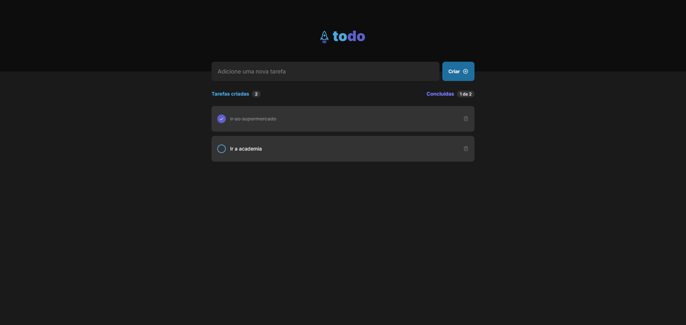

[TYPESCRIPT__BADGE]: https://img.shields.io/badge/typescript-D4FAFF?style=for-the-badge&logo=typescript
[REACT__BADGE]: https://img.shields.io/badge/React-005CFE?style=for-the-badge&logo=react
[PROJECT__BADGE]: https://img.shields.io/badge/visite_este_projeto-black?style=for-the-badge
[PROJECT__URL]: https://to-do-list-5dj08n1kj-gustavo-teofilos-projects.vercel.app/

<h1 align="center" style="font-weight: bold;">To-do list 💻</h1>

![react][REACT__BADGE] ![typescript][TYPESCRIPT__BADGE]

<p align="center">
 • <a href="#about">Sobre</a> • 
 <a href="#started">Getting Started</a>
</p>

<p align="center">
    
</p>

<h2 id="about">📌 Sobre</h2>

Este repositório trata-se de uma aplicação de controle de tarefas no estilo to-do list, desenvolvido com React.

[![project][PROJECT__BADGE]][PROJECT__URL]

<h2 id="started">🚀 Getting started</h2>

<h3>Pré-requisitos</h3>

- [NodeJS](https://nodejs.org/en/download)
- [Git](https://git-scm.com/downloads)

<h3>Clonagem</h3>

Para clonar o projeto, em seu terminal digite o seguinte comando:

```bash
git clone https://github.com/GTM35/to-do-list.git
cd to-do-list
```

<h3>Starting</h3>

Para iniciar o projeto, em seu terminal digite os seguintes comandos:

```bash
npm install
npm run dev
```
